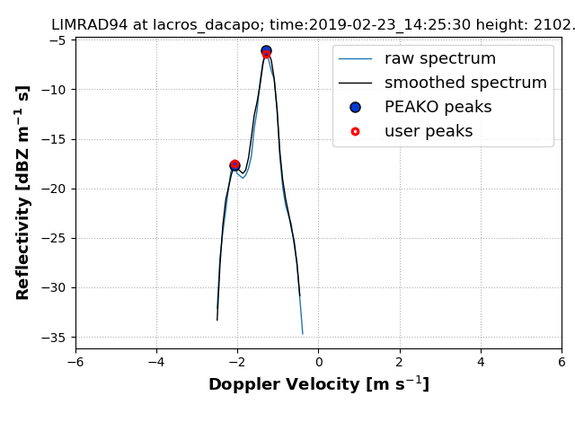

# pyPEAKO


**PEAKO** is a supervised radar Doppler spectrum peak finding algorithm. It finds the optimal 
parameters for detecting peaks in cloud radar Doppler spectra using user-generated training data. 


**PEAKO** is used to: 
- create labeled data (peaks marked by a user in cloud radar Doppler spectra), which can be used for training and testing the learned function
- train the algorithm using the labeled data to obtain the optimal parameter combination for peak detection. Optimization is done using a similarity measure based on the area below the peaks.
- test the performance of the learned function [TBD]
- detect peaks in cloud radar Doppler spectra using the learned function


Reference for PEAKO: [Kalesse et al. (2019), AMT](https://www.atmos-meas-tech.net/12/4591/2019/)



-------------------
Python 3.6 or higher, xarray, numpy, scipy, json (probably)


## TBD : Installation
I want this package to be available via pip so that one can simply do :
``` 
$ pip install pyPEAKO
```

In the meantime, you will have to clone the repository, e.g. by
 ```
$ git clone https://github.com/ti-vo/pyPEAKO
```

Then navigate to the main folder (pyPEAKO):

```
$ python3 setup.py install --user
```

## How PEAKO works
The current release is tailored to use cloud radar Doppler spectra netcdf files. The files are in a format which is 
currently under discussion in the Cloudnet community. Changes are likely to be made in the future, and Peako will have 
to be adjusted to work with the most current spectra file format. 
The cloudnet community will hopefully share their routines for bringing spectra files from different cloud radars into 
the desired format. Ongoing discussion is happening in the [Cloudnet forum](https://forum.cloudnet.fmi.fi/)  .

### creating training data
To train PEAKO, it is necessary to mark peaks in some spectra by hand.  
```python3
import peako

train = peako.TrainingData(['/path/to/file/spectra.nc'],
                     num_spec=[20])
train.mark_random_spectra()
train.save_training_data()

``` 
The user marks the peaks in the center panel of the plotting window which pops up:

## Contributing
If you want to help develop peako, feel free to contact me, or open an issue on GitHub. If you want to become an active 
developer, that would be awesome! You will first have to install the "dev" dependencies specified in setup.py. 
To install PEAKO  along with the tools you need for developing and running tests, run:
```bash
$ pip install -e .[dev]
```
in the directory containing the setup.py file.
